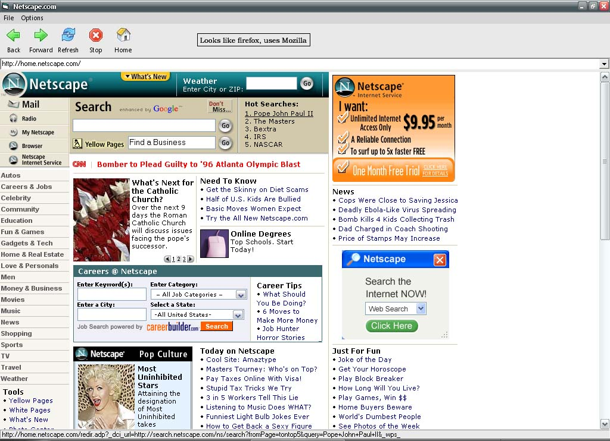



## A new kind of browser \(Using mozilla, NOT IE\!\)

### Description

Want to make a browser but hate IE? Now you can use mozilla thanks to the help of the mozilla active x control

http://www.iol.ie/~locka/mozilla/control.htm
 
### More Info
 

             |
---                |---
**Submitted On**   |2005-04-09 08:00:58
**By**             |[Hebosaurus](https://github.com/Planet-Source-Code/PSCIndex/blob/master/ByAuthor/hebosaurus.md)
**Level**          |Beginner
**User Rating**    |4.5 (100 globes from 22 users)
**Compatibility**  |VB 6\.0
**Category**       |[Internet/ HTML](https://github.com/Planet-Source-Code/PSCIndex/blob/master/ByCategory/internet-html__1-34.md)
**World**          |[Visual Basic](https://github.com/Planet-Source-Code/PSCIndex/blob/master/ByWorld/visual-basic.md)
**Archive File**   |[A\_new\_kind187435492005\.zip](https://github.com/Planet-Source-Code/hebosaurus-a-new-kind-of-browser-using-mozilla-not-ie__1-59899/archive/master.zip)

